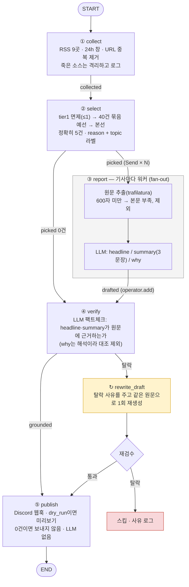
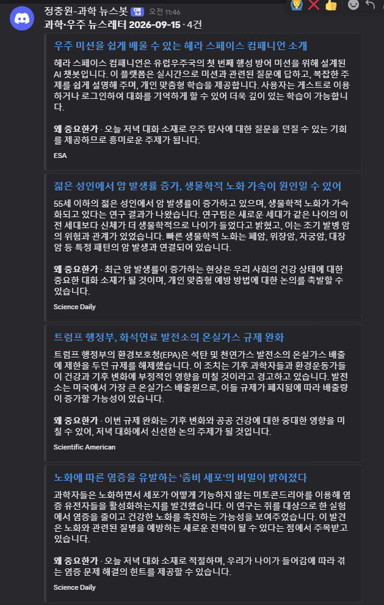

# REPORT — 과학·우주 뉴스레터 에이전트

> [실습 프로젝트] 나만의 뉴스레터 에이전트 구축하기 · 정충원 · 2026-09-15
> 저장소: https://github.com/GojoSuperman/Newsletter-Agent

매일 아침 과학·우주 소식을 9개 소스에서 모아, 일반 독자에게 의미 있는 5건을 고르고, 원문을 읽어 3문장 요약과 "왜 중요한가"를 쓰고, 요약이 원문에 근거하는지 검수한 뒤(탈락하면 한 번 다시 쓰고, 그래도 탈락이면 건너뜀), Discord 채널로 발행하는 LangGraph 에이전트입니다.

| 필수 단계 | 구현 위치 | 근거 자료 |
|---|---|---|
| ① 자료 수집 (3개 이상, 제외 목록 배제) | `newsletter/nodes/collect.py`, `audience.yaml` (9개 소스) | 2장 소스 채택표 |
| ② 자료 선별 (3~5건, 기준·근거) | `newsletter/nodes/select.py` | 3장, 5장 로그의 `[토픽]` 라벨 |
| ③ 요약·인사이트 | `newsletter/nodes/report.py` (headline / summary / why) | 5장 발행 카드 |
| ④ 자동 검수·예외 처리 | `newsletter/nodes/verify.py` (근거 판정 → 재생성 1회 → 스킵) | 5장 로그의 `↻ 재생성` |
| ⑤ 최종 발행 | `newsletter/nodes/publish.py` (Discord 웹훅) | 5장 캡처 |

실행: `uv run python run.py --hours 24 --dry-run` (Discord 미발송) / `--dry-run` 제거 시 실발송. 실행 기록은 `store/runs/<id>.json`, 지표는 `store/metrics.jsonl`.

---

## 1. 분야 및 독자 정의

**분야: 과학·우주.** 이 프로젝트는 원래 "국내 AI 개발팀"용 AI 뉴스레터로 만들었습니다. 과제 제출을 위해 분야를 완전히 바꾸었는데, 두 가지 이유입니다.

1. 과제 제외 목록 6곳(OpenAI, DeepMind, TechCrunch, The Verge, MIT TR, AI타임스) 중 5곳이 기존 소스였습니다. 소스를 갈아엎어야 한다면, 코드가 정말로 분야 독립적인지(`audience.yaml`만 바꾸면 되는지) 검증할 기회로 삼았습니다.
2. 과학·우주는 당사자 발표(NASA·ESA·CERN)와 매체 보도가 모두 RSS로 열려 있고, 매일 새 글이 40건 안팎으로 올라와 예선·본선 2단계와 검수가 실제로 작동하는 것을 보이기에 적당한 밀도입니다.

**독자 페르소나: 과학을 좋아하는 일반 성인.** 출근길에 5분 읽는 교양 독자입니다. 전공자가 아니므로 전문용어에는 한 줄 설명이 붙어야 하고, 논문의 통계 자체보다 "그래서 오늘 저녁에 누구에게 얘기해 줄 만한가"가 기준입니다. 이 한 문장이 선별 프롬프트의 판단 문장이 됩니다.

```yaml
audience: 과학을 좋아하는 일반 성인 독자 (출근길에 5분 읽는 교양 독자)
question: 오늘 저녁 대화 소재가 될 만한 발견·발사·사건인가
topics: [우주·천문, 물리·화학, 생명·의학, 지구·기후, 과학정책·산업]
tone: 쉬운 말로 풀어 쓴 존댓말. 전문용어에는 한 줄 설명을 붙인다. 과장 없이.
```

코드에는 분야가 박혀 있지 않습니다. AI → 과학·우주 전환에서 파이프라인 코드는 한 줄도 바꾸지 않았고, `audience.yaml`과 화면 문구만 바꿨습니다.

---

## 2. 소스 채택표

2026-09-15 `newsletter/sources_check.py`(관문 G1·G2·G3)와 같은 함수를 쓰는 탐색 스크립트로 후보 18곳을 실측했습니다. 기준은 네 가지입니다.

| 관문 | 뜻 | 기준 | 왜 |
|---|---|---|---|
| G1 본문 | 원문이 추출되는가 | 최근 3건 중 600자 이상 | 본문이 없으면 LLM이 제목만 보고 지어냄 |
| G2 생존 | 지금도 글이 올라오는가 | 14일 내 게시 1건 이상 | 죽은 소스는 조용히 0건을 낸다 |
| G3 접근 | 자동 수집을 막지 않는가 | robots.txt 허용 (우리 UA로 확인) | 차단은 어느 날 갑자기 온다 |
| 밀도 | 하루 몇 건인가 | 0.5~15건/일 | 너무 많으면 예선을 잡아먹고, 너무 적으면 기여가 없다 |

| 소스 | 피드 | 건수 | 하루 | G1 본문 (3건 길이) | G2 14일 | G3 | 판정 · 근거 |
|---|---|---:|---:|---|---:|---|---|
| NASA | nasa.gov/news-release/feed | 10 | 3.2 | 3/3 (1173·4619·2809) | 10 | 허용 | **채택** tier 2. 처음엔 tier 1이었으나 웨비나 공지가 면제로 올라와 경쟁으로 내림(5장) |
| ESA | esa.int/rssfeed/…/Space_News | 9 | 0.6 | 3/3 (897·1718·11370) | 8 | 허용 | **채택** tier 1. 당사자 발표, 희소 |
| CERN | home.cern/news/feed | 10 | 2.0 | 3/3 (3591·3487·1213) | 10 | 허용 | **채택** tier 1. 물리 당사자 |
| Science Daily | sciencedaily.com/rss/all.xml | 60 | 11.3 | 3/3 (6489·12153·7587) | 60 | 허용 | **채택** tier 2. 생명·의학 폭 넓음 |
| Space.com | space.com/feeds/all | 50 | 9.8 | 3/3 (4666·4112·3117) | 50 | 허용 | **채택** tier 2 |
| Scientific American | scientificamerican.com/…/rss | 50 | 4.8 | 3/3 (4584·3191·11251) | 50 | 허용 | **채택** tier 2. 정책·산업 시각 |
| Universe Today | universetoday.com/feed | 20 | 3.8 | 3/3 (3801·10501·4473) | 20 | 허용 | **채택** tier 2 |
| Ars Technica Science | feeds.arstechnica.com/…/science | 20 | 1.8 | 3/3 (1911·2087·16703) | 20 | 허용 | **채택** tier 2 |
| Quanta Magazine | quantamagazine.org/feed | 5 | 0.8 | 3/3 (16315·10042·12606) | 5 | 허용 | **채택** tier 2. 적지만 원문이 깊음 |
| Phys.org (전체) | phys.org/rss-feed | 30 | 115.8 | 3/3 | 30 | 허용 | **탈락** 밀도. 하루 100건 넘는 집계 피드라 예선 묶음을 혼자 채움 |
| Phys.org (우주) | phys.org/rss-feed/space-news | 30 | 6.1 | 3/3 | 30 | 허용 | **탈락** 중복. Universe Today·Space.com과 같은 보도자료를 다시 씀 |
| Nature (nature.rss) | nature.com/nature.rss | 75 | 5.0 | **0/3** (286·286·286) | 75 | 허용 | **탈락** G1. 유료 논문이라 초록 286자만 추출됨 |
| Nature (subject RSS) | nature.com/subjects/…rss | 0 | – | – | 0 | – | **탈락** 빈 피드 |
| ESO | eso.org/public/news/feed | 10 | 0.1 | 3/3 (18008·12762·13340) | **0** | 허용 | **탈락** G2. 최신 글이 27일 전, 14일 내 0건 |
| New Scientist | newscientist.com/feed/home 외 2종 | – | – | – | – | **406/500** | **탈락** G3. 봇 UA를 406으로 거부 |
| 동아사이언스 | dongascience.com/rss 3종 | – | – | – | – | 404/빈 피드 | **탈락** 피드 없음. 한국어 소스를 넣고 싶었으나 RSS 미제공 |
| NASA (전체 feed) | nasa.gov/feed | 10 | 3.2 | 3/3 | 10 | 허용 | **탈락** 중복. news-release 피드와 항목이 동일 |
| CERN (api/…/feed.rss) | home.cern/api/news/news/feed.rss | – | – | – | – | 404 | **탈락** URL 폐기, `news/feed`로 대체 |

과제 제외 목록 6곳은 후보에 넣지 않았습니다. 채택 9곳의 하루 합계는 약 38건이라 24시간 창에서 41건이 모였고(5장), 예선 묶음 40건 기준으로 하루 한두 묶음이 됩니다.

재현: `uv run python -m newsletter.sources_check` (채택된 소스만 대상, "하루" 열 포함).

---

## 3. 선별 로직 설계

**중요도 판단 문장.** 프롬프트에 들어가는 문장은 `audience.yaml`의 `question` 한 줄입니다.

> "오늘 저녁 대화 소재가 될 만한 발견·발사·사건인가"

여기에 독자(`audience`)와 관심 토픽(`topics`)을 붙여 시스템 프롬프트를 만들고, "같은 사건은 하나만, 홍보성 글은 제외"를 고정 규칙으로 둡니다.

**예선 / 본선 2단계.**

| 단계 | 입력 | 출력 | 방식 |
|---|---|---|---|
| 면제 | tier 1(당사자 발표) 최신순 | 최대 `tier1_max`=1건 | LLM 없이 통과. 매체 여러 곳이 같은 사건을 쓸 때 원 발표가 밀리지 않게 |
| 예선 | 나머지를 40건씩 묶음 | 묶음당 5건 | 묶음 안에서 상대평가. 후보가 40건 이하면 건너뜀 |
| 본선 | 예선 통과분 전체 | 정확히 5 − 면제 건 | 서로 견주어 순위, 건마다 한 문장 이유 + 토픽 라벨 |

개별 채점(10점 만점)을 쓰지 않은 이유는 점수가 7~8점에 몰려 5건이 갈리지 않기 때문이고, 전체를 한 번에 넣지 않는 이유는 100건짜리 프롬프트에서 중간 항목이 무시되기 때문입니다.

**묶음 크기 40.** 한 줄에 URL·출처·제목·요약 120자로 약 60토큰이라 40건이면 2,400토큰 안팎입니다. 이 정도면 한 프롬프트에서 항목을 빠짐없이 견줄 수 있고, 하루 38건 규모에서는 대개 본선만 돌아 비용이 LLM 호출 1회입니다. 소스가 늘어 80건이 되면 자동으로 예선 2묶음이 됩니다.

**건수는 코드가 강제.** "정확히 5건"이라는 부탁은 지켜지지 않을 때가 있어 `out[:n]`으로 자르고, 모르는 URL과 중복은 버립니다.

**기준이 의도대로 동작했다는 근거.** 본선 응답에 `topic` 필드를 받아 `Pick`에 저장하고 로그에 `[토픽] 출처 · 제목 · 이유`를 한 줄씩 남깁니다. 5장 로그를 보면 5건이 4개 토픽에 흩어져 있고(우주·천문 당사자 발표, 지구·기후, 생명·의학 ×2, 과학정책·산업), 이유 문장이 모두 "독자에게 왜"를 말하고 있습니다. 라벨은 `store/runs/<id>.json`의 `picked[].topic`에도 남아 나중에 토픽 편중을 셀 수 있습니다.

---

## 4. 파이프라인 구조도



**State (`newsletter/state.py`).** 단계 사이를 건너가는 것만 담습니다.

| 키 | 채우는 노드 | 리듀서 | 내용 |
|---|---|---|---|
| `hours`, `dry_run` | 입력 | – | 수집 창, 발송 여부 |
| `collected: list[Article]` | ① | 덮어쓰기 | title·url·source·tier·at·summary |
| `picked: list[Pick]` | ② | 덮어쓰기 | Article + reason + **topic** |
| `drafted: list[Draft]` | ③ 워커들 | `operator.add` | Pick + headline·summary·why·body + **regenerated** |
| `verified: list[Draft]` | ④ | 덮어쓰기 | 통과분(재생성 통과 포함) |
| `log: list[str]` | 모든 노드 | `operator.add` | 단계별 한 줄 + 탈락·재생성 사유 |

노드는 의존성(`http_get`, `ask`, `extract`, `post`, `rewrite`)을 인자로 받는 순수 함수이고 `graph.py`의 `real_nodes()`가 `functools.partial`로 묶어 등록합니다. 그래서 테스트 85개가 네트워크·OpenAI·Discord 없이 돕니다.

**검수 실패 시 대안.** ④에서 탈락하면 `rewrite_draft`가 탈락 사유와 이전 요약을 프롬프트에 넣어 같은 원문으로 다시 쓰고 재검수합니다. 재생성은 한 번뿐이고, 두 번째도 탈락이면 그 기사는 건너뜁니다(되돌아가서 다른 기사를 고르지 않음 — 못 채우는 날은 있는 만큼만 발행). 두 경우 모두 `↻ 재생성 후 통과/탈락` 로그와 `metrics.jsonl`의 `regenerated`·`regen_passed`로 남습니다.

---

## 5. 실행 기록

### 5.1 실발송 실행 (2026-09-15 11:45 KST, `store/runs/20260915T024544.json`)

```
① 수집    24시간 창 · 41건 · 소스 9/9
② 선별    41 → 5건 · 본선만 · 면제 1
   · [당사자 발표] ESA · Questions? Ask our Hera Space Companion! · 당사자 발표
   · [지구·기후] Universe Today · CubeSat Instrument Extends Solar Storm W · CubeSat의 신기술이 태양폭풍 경고 시스템의 정확성을 10배 향상시켜 …
   · [생명·의학] Science Daily · Cancer is rising in younger adults. Fast · 젊은 성인의 암 발생률이 증가하고 있으며, 생물학적 노화가 그 원인일 수 있다는 …
   · [과학정책·산업] Scientific American · Trump repeals emissions regulations of f · 미국의 새로운 환경 정책 변화가 기후 변화 대응에 …
   · [생명·의학] Science Daily · Scientists find how "zombie" cells fuel  · '좀비' 세포가 염증 반응의 기전으로 작용하는 것을 발견한 연구는 …
③ 취재    완료 · ESA · 우주 미션을 쉽게 배울 수 있는 헤라 스페이스 컴패니언 소개
③ 취재    완료 · Scientific American · 트럼프 행정부, 화석연료 발전소의 온실가스 규제 완화
③ 취재    완료 · Universe Today · 큐브샛 인스트루먼트, 태양폭풍 경고 시간을 10배 늘리다
③ 취재    완료 · Science Daily · 노화에 따른 염증을 유발하는 '좀비 세포'의 비밀이 밝혀졌다
③ 취재    완료 · Science Daily · 젊은 성인에서 암 발생률 증가, 생물학적 노화 가속이 원인일 수 있어
④ 검수    4/5 통과
   ↻ 재생성 후 탈락 · Universe Today · HENON 큐브샛, 태양폭풍 경고 시간을 15시간에서 · 태양폭풍 경고 시간을 15시간에서 3시간으로 개선한다고 주장하지만, 원문에서는 현재의 경고 시간이 15분에서 60분이라고 명시되어 있습니다.
⑤ 발행    Discord · 4건
```

지표 한 줄 (`store/metrics.jsonl`):

```json
{"run_id": "20260915T024544", "hours": 24, "collected": 41, "picked": 5, "drafted": 5, "extract_ok": 5,
 "verified": 4, "published": 4, "regenerated": 1, "regen_passed": 0, "dead_sources": [],
 "by_source": {"ESA": 1, "Science Daily": 2, "Scientific American": 1},
 "seconds": {"collect": 9.44, "select": 6.76, "report": 4.29, "verify": 8.77, "publish": 0.71}, "dry_run": false}
```

검수가 잡아낸 오류를 보면 "15분→60분"을 "15시간"으로 잘못 옮긴 숫자 환각이었고, 재생성해도 같은 숫자를 틀려 스킵됐습니다. 과학 기사는 숫자·단위가 핵심이라 검수 단계가 실제로 일을 합니다.

### 5.2 Discord 발행 화면



보낸 사람 `정충원-과학 뉴스봇`, 제목 `과학·우주 뉴스레터 2026-09-15 · 4건`, 카드마다 headline(링크) · 3문장 summary · **왜 중요한가**.

### 5.3 직전 dry-run에서 배운 것 (같은 날 11:30, 로컬 기록)

첫 dry-run은 `tier1_max: 2`, NASA를 tier 1로 두고 돌렸습니다. 면제 2건이 NASA의 "웨비나 9/23 안내"와 "연구 제안 공모"였습니다. 당사자 발표 면제는 AI 분야(OpenAI 모델 발표)에서는 맞는 규칙이었지만, NASA 보도자료 피드는 행정 공지가 절반이라 일반 독자에게 맞지 않았습니다. 그래서 NASA를 tier 2로 내리고 상한을 1로 줄였고, 실발송에서는 ESA 1건만 면제됐습니다. 같은 dry-run에서 "젊은 성인 암" 기사가 1차 검수 탈락 → 재생성 → 통과한 사례도 있어(`regen_passed: 1`), 재생성 경로가 양쪽으로 다 작동함을 확인했습니다.

---

## 6. 프로젝트 회고

**가장 공들인 부분: 분야를 설정으로 분리한 것과, 소스를 "느낌"이 아니라 관문으로 고른 것.** AI 뉴스레터를 과학·우주로 바꾸는 데 파이프라인 코드는 손대지 않았고, 후보 18곳을 같은 잣대로 재서 표로 남겼습니다. 특히 Nature처럼 "당연히 좋은 소스"가 G1(본문 286자)에서 떨어지고, New Scientist가 봇 UA를 406으로 막는 것은 실측 없이는 몰랐을 일입니다.

**두 번째: 검수 실패의 대안을 "재생성 1회 → 스킵"으로 좁힌 것.** 무한 재시도는 비용을 예측할 수 없고, 되돌아가서 다른 기사를 고르는 것은 그래프를 복잡하게 만듭니다. 한 번 고쳐 보고 안 되면 빠지되 반드시 로그와 지표에 남긴다는 규칙 하나가 재시도 설계 전체를 대신합니다. 실발송 로그에서 재생성 후에도 같은 숫자를 틀린 사례는 이 상한이 적절했음을 보여 줍니다.

**보완하고 싶은 점.**

1. **평가셋.** 같은 날 두 번 돌리면 선별이 다릅니다(dry-run과 실발송은 설정 차이도 있지만, 5건 중 3건만 겹쳤습니다). 기사 30~50건에 사람이 정답을 붙여야 프롬프트 수정이 개선인지 알 수 있습니다.
2. **한국어 소스.** 동아사이언스가 RSS를 주지 않아 영문 소스만 남았습니다. 과학동아·KISTI 등을 스크래핑으로 붙이려면 robots 확인과 구조 변경 감지가 따라옵니다.
3. **재생성 시 검수 사유의 구조화.** 지금은 사유가 자유 문장이라 재생성 프롬프트가 "어디가 틀렸는지"를 문장으로만 받습니다. 틀린 수치·표현을 필드로 받으면 재생성 성공률이 오를 것입니다.
4. **토픽 편중 제어.** 라벨은 남기지만 "생명·의학 2건"처럼 편중이 생겨도 막지 않습니다. 토픽당 상한을 본선 프롬프트가 아니라 코드에서 강제하는 것이 다음 단계입니다.
5. **사람 승인 단계.** 리더 앱에는 "Discord로 보내기" 버튼이 있지만 CLI·Actions 경로는 검수 통과 즉시 발행합니다. 그래프를 멈췄다 재개하는 human-in-the-loop이 있으면 운영이 편해집니다.
